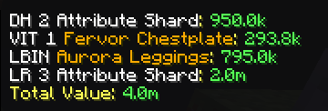
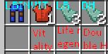
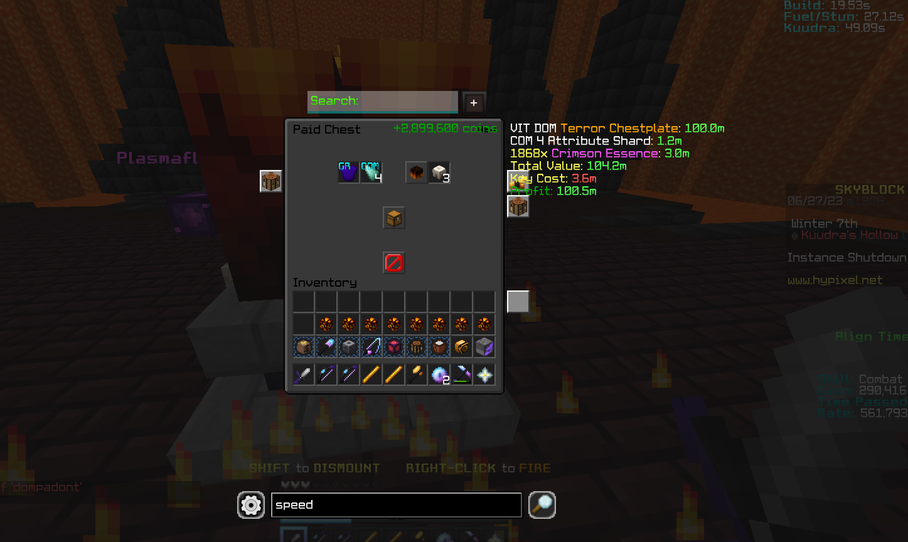

# Skyblock Utilities!
Skyblock utils currently hovers around kuudra related features. [(Table of Contents)](#table-of-contents) 

[//]: # (<!--add future download link-->)
### Mod: [SkyblockUtils-1.0.0.jar]()

## Table of Contents
- Features
    - [Chest pricing](#inventory-pricing) 
    - [Kuudra attribute Overlay](#kuudra-overlay)
    - [Party stats overall on Monke Finder](#kuudra-stats) 
    - [Show new member stats on join!](#on-join) 
    - [**PROFIT CALCULATOR**](PROFIT CALCULATOR) 
- Commands
    - [Main](#main) 
    - [Lbin of attribute (**armor**)](#attribute-pricing)
    - [Lbin of attribute (**equipment**)](#equipment-pricing)
    - [Estimates pricing to upgrade gear](#armor-upgrade)
    - [Show kuudra stats!](#viewing-kuudra-related-stats-and-items)
    - [Miscellaneous](#others) 

### Features
#### Inventory Pricing
This title is a little misleading! It shows the price of the current chest be it echest, paid chest, a chest on island! We'll add one for inventory soon!  

#### Kuudra Overlay
Shows the best attribute on the armour piece! 
[Read all about the kuudra overlay!]() 
LBIN is the armour is more expensive than the value of the attribute! 
[Read on comparison here!]() 

#### Kuudra stats
Hover over a party and press key-bind to check the party stats!
[Image soon]()

### On join
When a party member joins, their party stats will automagically appear in chat! _If you are wondering how, it's magic!_
[Not showing? Troubleshoot here](#toadd)

### PROFIT CALCULATOR
Of course saving the best for last!  
THE PROFIT CALCULATOR!! Self-explanatory

### Commands
#### Main
`/sbu` Shows gui  
`/sbu help` Sends help message in chat!

#### Attribute Pricing
##### Armour pricing
`/ap ah`
`/ap attribute level`
`/ap attribute attribute`
`/ap help`
[For more in-depth info about the arguments. Click me!](#toadd)

##### Equipment pricing
`/ap ah`
`/ap attribute level`
`/ap attribute attribute`
`/ap help`
[For more in-depth info about the arguments. Click me!](#toadd)

#### Armor Upgrade
`/au attribute`
`/au attribute level`
`/au attribute startlvl endlvl`
`/au help` 
[For more in-depth info about the arguments. Click me!](#toadd)

#### Viewing Kuudra related stats and items
`/ks`
`/ks ign`
`/ks help`
[For more in-depth info about the arguments. Click me!](#toadd)

#### Others
`/alias`
